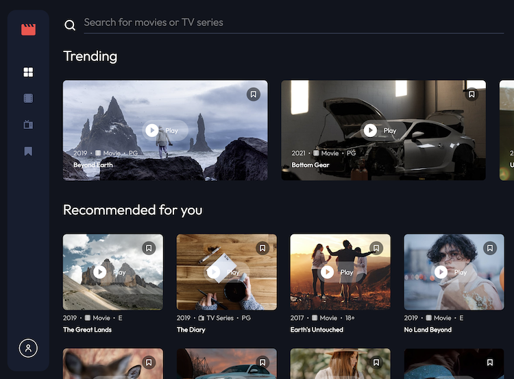

# Frontend Mentor - Entertainment web app solution

This is a solution to the [Entertainment web app challenge on Frontend Mentor](https://www.frontendmentor.io/challenges/entertainment-web-app-J-UhgAW1X). Frontend Mentor challenges help you improve your coding skills by building realistic project.

## Table of contents

- [Overview](#overview)
  - [The challenge](#the-challenge)
  - [Screenshot](#screenshot)
  - [Links](#links)
- [My process](#my-process)
  - [Built with](#built-with)
- [Author](#author)

## Overview

### How to use

Login to test user is:
user@test.com
1111

or you can register your own user.

### The challenge

Users should be able to:

- View the optimal layout for the app depending on their device's screen size
- See hover states for all interactive elements on the page
- Navigate between Home, Movies, TV Series, and Bookmarked Shows pages
- Add/Remove bookmarks from all movies and TV series
- Search for relevant shows on all pages
- **Bonus**: Build this project as a full-stack application
- **Bonus**: If you're building a full-stack app, we provide authentication screen (sign-up/login) designs if you'd like to create an auth flow

### Screenshot

### Links

- Solution URL: [https://github.com/K-ost/entertainment-app](https://github.com/K-ost/entertainment-app)
- Live Site URL: [https://k-ost.github.io/entertainment-app/](https://k-ost.github.io/entertainment-app/)

## My process

### Built with

- Semantic HTML5 markup
- Mobile-first workflow
- [MUI React](https://mui.com/) - Material UI React for styling
- [React](https://reactjs.org/) - JS library
- [Zustand](https://zustand-demo.pmnd.rs/) - For state manager
- [React Hook Form](https://react-hook-form.com/) - For form validation
- [Tanstack Query](https://tanstack.com/query/latest) - For server requests
- [Render](https://render.com/) - Space for Server API
- [JSON Server](https://www.npmjs.com/package/json-server) - For server imitation with auth
- [Vitest](https://vitest.dev/) - Tool for testing and debugging as well as React Testing Library

## Author

- Website - [https://github.com/K-ost/](https://github.com/K-ost/)
- Frontend Mentor - [@K-ost](https://www.frontendmentor.io/profile/K-ost)
